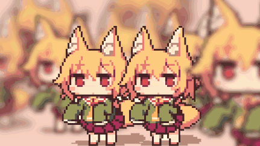

  

  <i>neural dreamer - quantum hacker - os architect</i>

 

  
  
  
  

---

<table>
<tr>
<td width="60%">

<h2><b>hi, i'm DelfinVT!</b></h2>

<b>welcome to my neural network</b> 
hacker by passion, dolphin by soul. building an OS, breaking things, and bridging neural networks with cybersecurity.

 

<table border="0" cellpadding="0" cellspacing="0" style="background: #0D1117; border-radius: 12px; border: 1px solid #B891FF;">
  <tr>
    <td style="padding: 16px 24px; font-family: 'Fira Code', 'Cascadia Code', monospace; color: #E0E0E0; font-size: 14px; line-height: 1.8;">
      $ whoami
      
      alias   - Delfin / Z 
      role    - Hacker &amp; Researcher 
      focus   - Post-Quantum, AI, Security 
      stack   - Python, Rust, Nim, C 
      status  - building the future
    </td>
  </tr>
</table>

 

  
  
  
  
  

</td>
<td width="40%" align="center">

</td>
</tr>
</table>

---

<h2><b>arsenal</b></h2>

  
   
  
   
  

---

<h2><b>metrics</b></h2>

  

---

<h2><b>projects</b></h2>

<table>
<tr>
  <th>Project</th>
  <th>Description</th>
  <th>Stack</th>
  <th>Status</th>
</tr>
<tr>
  <td><b>Nyra Neural</b></td>
  <td>AI assistant with quantum-resistant encryption and emotion simulation</td>
  <td><code>Python</code> <code>TensorFlow</code> <code>Rust</code></td>
  <td>Active</td>
</tr>
<tr>
  <td><b>Proyecto Leviathan</b></td>
  <td>Advanced surveillance system - like an all-seeing eye, but better</td>
  <td><code>Nim</code> <code>C++</code> <code>Python</code> <code>Bash</code></td>
  <td>v3.1.4</td>
</tr>
<tr>
  <td><b>MedArch OS</b></td>
  <td>Medical OS built on Arch Linux with custom kernel, optimized for any device, includes 150+ free medical tools</td>
  <td><code>Rust</code> <code>C</code> <code>Linux Kernel</code></td>
  <td>Beta</td>
</tr>
<tr>
  <td><b>QuantumLock</b></td>
  <td>Post-quantum cryptography library for future-proof systems</td>
  <td><code>Nim</code> <code>Python</code> <code>C</code> <code>Asm</code> <code>Go</code></td>
  <td>WIP</td>
</tr>
<tr>
  <td><b>DolphinXVR</b></td>
  <td>VR overlay for vtubers, streamers and everyday use - enhancing virtual reality</td>
  <td>--</td>
  <td>Planning</td>
</tr>
</table>

---

  
    
  <i>"the system sees you."</i>
   
  you don't exist unless someone sees you

