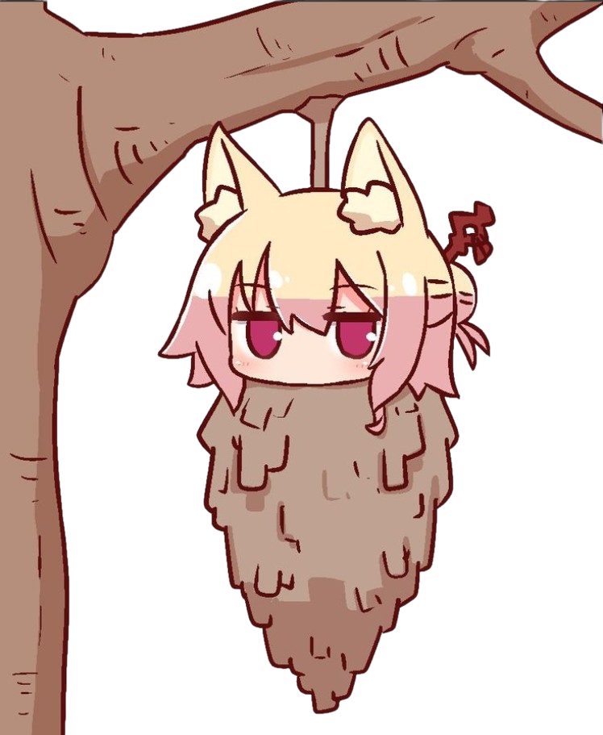

  
  
  <h1>Hi, I'm Delfin 👋</h1>
  
<b>Cybersecurity Researcher | Low-Level Developer | VTuber</b>

  
  

    Building operating systems, breaking binaries, and exploring virtual realities.
  

  

    
    
    
  

---

### 👨‍💻 About Me

I focus on the intersection of cybersecurity, reverse engineering, and low-level system architecture. When I'm not digging into assembly code or analyzing malware samples, I'm probably streaming, configuring Hyprland, or building communities.

* 🔭 **Currently building:** **DolphinXVR** (a SteamVR overlay) and expanding **DolphinEngineering**.
* 🌱 **Focused on:** Malware analysis, threat emulation, and VR development.
* 💻 **Environment:** Arch Linux + Hyprland + Fish.
* 💬 **Ask me about:** Reverse engineering (IDA, Ghidra), C/Rust/Nim.

### 🛠️ Tech Stack & Arsenal

**Languages**

  

**Security & Reverse Engineering**

  <code>Ghidra</code> <code>IDA</code> <code>x64dbg</code> <code>Wireshark</code> <code>Burp Suite</code> <code>Nmap</code> <code>Radare2</code> <code>FLARE VM</code>

**Infrastructure & Tools**

  

---

### 🚀 Featured Projects

| Project | Description | Tech Stack |
| :--- | :--- | :--- |
| **Leviathan** | Security research and advanced threat emulation framework. | `Nim` `C++` `Python` |
| **MedArch OS** | Medical Linux distro optimized for low-resource hardware. | `Rust` `C` `Linux Kernel` |
| **DolphinXVR** | Open-source VR overlay designed for SteamVR. | `Rust` `Python` `Tauri` `C#` |
| **Academia Delfin** | Free community-based cybersecurity learning program. | `Education` `Community` |

---

  
  
    
  

