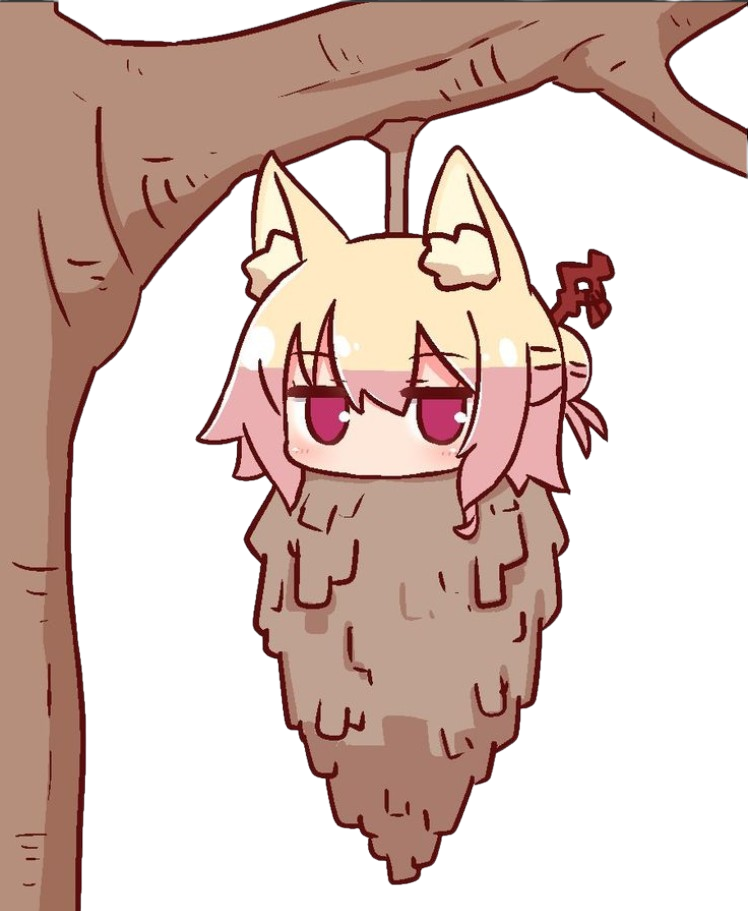

  

  <h1>Delfin</h1>
  
Malware analysis, reverse engineering and systems programming. I also stream as a VTuber.

  

    
    
    
  

---

## About

I spend most of my time reading assembly, taking malware samples apart and writing low-level code. Outside of that I stream, tweak my Hyprland setup and help run a small learning community.

Right now I'm working on:

- **DolphinXVR**, a SteamVR overlay.
- **DolphinEngineering**, which I'm slowly growing into a proper organization.
- Malware analysis and threat emulation write-ups.

Ask me about reverse engineering (IDA, Ghidra) or about C, Rust and Nim.

My setup is Arch Linux, Hyprland and Fish.

## Projects

| Project | What it is | Stack |
| :--- | :--- | :--- |
| [Leviathan](#) | Threat emulation framework for security research. | Nim, C++, Python |
| [MedArch OS](#) | Linux distro for medical use, tuned for low-resource hardware. | Rust, C |
| [DolphinXVR](#) | Open-source overlay for SteamVR. | Rust, Python, Tauri, C# |
| [Academia Delfin](#) | Free cybersecurity course run by the community. | Community project |

## Tools

**Languages:** C, C++, Rust, Assembly, Nim, Go, Python, C#

**Reverse engineering and analysis:** Ghidra, IDA, x64dbg, Radare2, Wireshark, FLARE VM

**Web and network:** Burp Suite, Nmap

**Daily environment:** Arch Linux, Hyprland, Fish, Git, Docker

## Contact

Email me at DelfinVT@proton.me or find me on Twitter and YouTube using the badges above.
